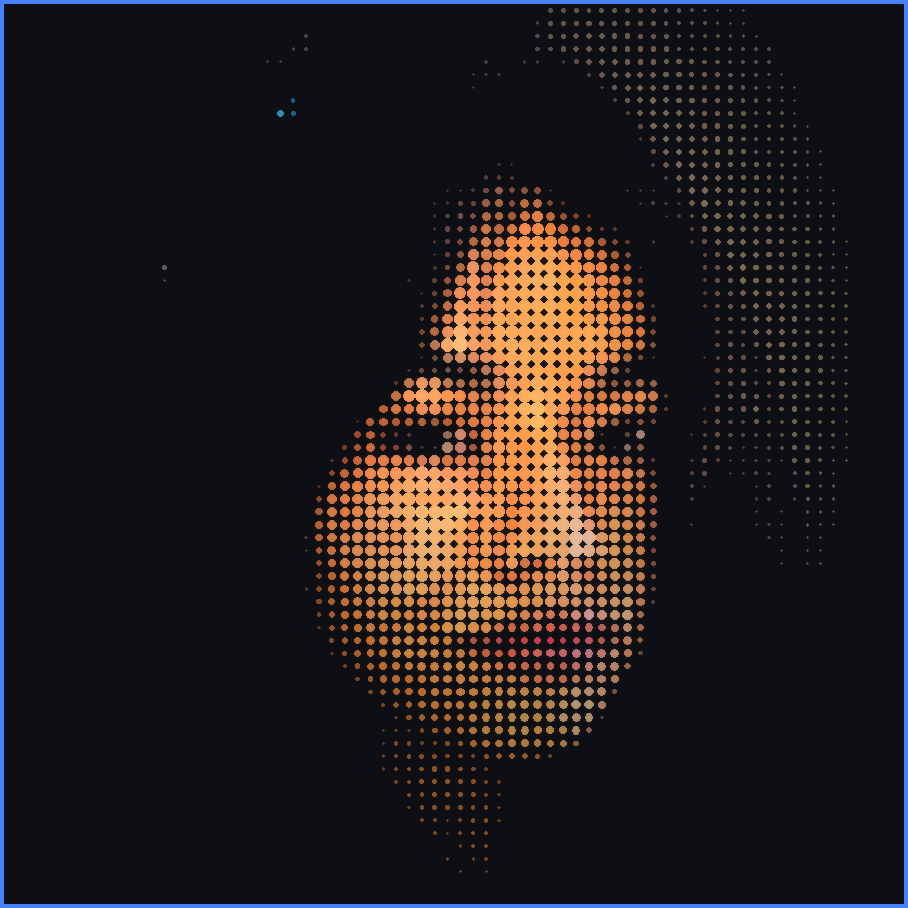

<h1 align="center">Hi there, I'm Aayushi 👋</h1>

<h3 align="center">Building things for the web, one commit at a time 🚀</h3>

  

---

### 🧑‍💻 About Me

- 🎨 I'm focused on **Frontend Development & Web Design** 
- 🌱 I'm currently learning **React & JavaScript frameworks**
- 👯 I'm looking to collaborate on **cool frontend/web projects**
- 💬 Ask me about **UI, web design, or getting started in frontend dev**
- ⚡ Fun fact: **I love journaling** 📝

---

### 🛠️ Tech Stack

  

---

### 📊 GitHub Stats

  
  

  

---

### 📌 Pinned Projects

> Once you build a few projects, pin your best ones from your GitHub profile settings — they'll show up as cards right below your profile.

---

### 🌐 Connect with Me

  
  

---

<i>⭐️ From <a href="https://github.com/aayushiag27">aayushiag27</a></i>

